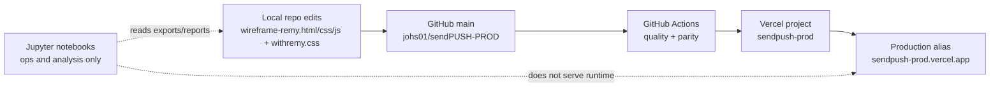

# REMY Repository System Overview

## Purpose and Audience

This document is the master architecture overview for this repository.

Use it when you need to understand how the live REMY system is assembled and maintained across local development, Codex/LLM workflows, GitHub governance, and Vercel delivery.

Primary audience:

1. Frontend technicians maintaining the live experience.
2. LLM agents assisting with implementation and documentation.
3. Operators validating deployment, parity, and governance controls.

Use other docs for detailed procedures:

- Runtime authority details: `docs/architecture/source-mirror-authority.md`
- Context and governance summary: `docs/PROJECT_CONTEXT.md`
- Token inventory: `docs/design-system/remy-token-catalog.md`
- DOM selector contracts: `docs/contracts/remy-dom-runtime-contracts.md`
- Pixel parity runbook: `docs/remy-pixel-parity.md`

## System at a Glance

The live site is a Next.js shell that source-mirrors canonical REMY static files.

## Authoritative Runtime Model (REMY)

Canonical runtime model: **source-mirror**.

The live route `/` renders markup extracted from the canonical static REMY file and loads CSS/JS via route handlers that serve source file contents.

### Source-of-Truth Files

| Concern | Authoritative file | Role |
|---|---|---|
| Markup | `wireframe-remy.html` | Canonical DOM structure and section ordering |
| REMY page styling | `wireframe-remy.css` | Page-specific visuals, interactions, responsive behavior |
| REMY behavior | `wireframe-remy.js` | Runtime interactions (sticky nav, menu, pricing toggle, reveals, form UX) |
| Design-system base tokens | `design-system/withremy/withremy.css` | Base token layer and core style primitives |

### Runtime Wiring Files

| Concern | Runtime file | Role |
|---|---|---|
| Body source mirror | `app/page.tsx` | Injects `<body>` content extracted from canonical HTML |
| Source reader | `lib/remy-source.ts` | Reads canonical HTML/CSS/JS/token source from disk |
| Token CSS route | `app/remy/withremy.css/route.ts` | Serves `withremy.css` |
| REMY CSS route | `app/remy/wireframe-remy.css/route.ts` | Serves `wireframe-remy.css` |
| REMY JS route | `app/remy/wireframe-remy.js/route.ts` | Serves `wireframe-remy.js` |

## Design System and Styling Ownership

The styling system is split intentionally into two authoritative layers:

1. `--wr-*` tokens and base system styles in `design-system/withremy/withremy.css`
2. `--wf-*` runtime semantic/state variables and component behavior in `wireframe-remy.css`

Ownership boundaries:

- Edit `withremy.css` for foundational token primitives and global design-system baseline.
- Edit `wireframe-remy.css` for REMY section behavior, component styling, state layers, and runtime polish.
- Do not create a parallel token namespace for the live REMY runtime.
- Do not hardcode design literals in markup when an existing token applies.

Authoritative token reference: `docs/design-system/remy-token-catalog.md`.

## Behavior and JS Runtime Ownership

All live interaction logic is owned by `wireframe-remy.js`.

Contract-critical selectors and IDs are documented in `docs/contracts/remy-dom-runtime-contracts.md` and include:

- Theme toggles and persistence contract (`wf-theme-mode`, toggle IDs)
- Pricing controls (`[data-pricing-toggle]`, `[data-pricing-stack]`, `.wf-pricing-billed-label`)
- Mobile menu controls (`#wfMobileMenuToggle`, `[data-mobile-menu-close]`, `.wf-mobile-menu-links`)
- Reveal hooks (`.reveal`, `data-reveal-order`)
- Trial form (`#wf-tenant-trial-form`)

If these selectors are renamed or removed without contract updates, runtime behavior and parity checks can fail.

## Platform Integration Map

| Plane | What it does | Source of truth | Notes |
|---|---|---|---|
| Local repo | Authoring, testing, parity checks | This repository | Canonical REMY files are edited directly |
| Codex / LLMs | Assisted implementation, review, documentation | Repo files + docs contracts | Must respect source-mirror authority and selector contracts |
| GitHub | Version control + PR governance | `https://github.com/johs01/sendPUSH-PROD` | `main` is protected; checks enforce release gates |
| Vercel | Build and host production | Project `sendpush-prod` | Production alias: `https://sendpush-prod.vercel.app` |
| Jupyter (Ops/Analysis only) | Notebook analysis/reporting workflows | External notebook environment | Not a runtime host and not a deployment target |

### Vercel Contract

- Project: `johs01s-projects/sendpush-prod`
- Production alias: `https://sendpush-prod.vercel.app`
- Important env var: `NEXT_PUBLIC_SITE_URL` (used for canonical/SEO metadata)

### GitHub Governance Contract

Current `main` branch protection:

- Required checks: `quality`, `parity` (strict)
- Pull requests required with 1 approval
- Enforce admins: enabled
- Force push: disabled
- Deletions: disabled
- Required linear history: enabled
- Required conversation resolution: enabled

## Change Lifecycle (Safe Update Flow)

Use this flow for all UI-affecting REMY changes:

1. Edit canonical source files:
   - `wireframe-remy.html`
   - `wireframe-remy.css`
   - `wireframe-remy.js`
   - `design-system/withremy/withremy.css` (only if token/base updates are needed)
2. Run contract checks:
   - `npm run check:selector-contracts`
   - `npm run check:token-integrity`
3. Run parity verification:
   - `npm run parity:check`
4. Run full quality/security verify locally when appropriate:
   - `npm run verify`
5. Commit and push to GitHub via PR flow.
6. Ensure GitHub checks pass (`quality`, `parity`).
7. Merge to `main`; validate Vercel production deployment.
8. If parity regression appears in production, rollback via source-file revert and rerun checks.

## Security and Governance

Repository and deployment governance currently rely on:

1. Protected `main` branch in GitHub.
2. Required CI checks (`quality`, `parity`) before merge.
3. Production dependency audit gate (`npm run audit:prod`) in CI.
4. Vercel project-level access control for production deploys.

Visibility implication:

- Repository is currently public. This was chosen to allow branch protection on the active GitHub plan while preserving governance requirements.

## Known Non-Canonical Layers

`components/` exists as an archived migration/reference layer and is not runtime-authoritative for live parity work.

Authoritative guidance:

- `docs/architecture/archived-component-layer.md`
- `docs/architecture/adr-0001-source-mirror-to-component-migration.md`

For production parity work, do not treat `components/` styles/logic as the source of truth.

## Troubleshooting

### 1) Parity drift

Symptoms:

- Screenshot diffs fail.
- Responsive behavior diverges from canonical static rendering.

Actions:

1. Confirm edits were made in canonical source files, not archived layers.
2. Re-run `npm run check:selector-contracts` and `npm run check:token-integrity`.
3. Re-run `npm run parity:check` and inspect `.parity/` artifacts.

### 2) Missing selector contract

Symptoms:

- Menu/theme/pricing/form interactions stop working.

Actions:

1. Validate IDs/classes/data-attrs against `docs/contracts/remy-dom-runtime-contracts.md`.
2. Restore or update selector contracts and rerun checks.

### 3) Stale env metadata in production

Symptoms:

- Canonical/OG URL mismatch in metadata.

Actions:

1. Confirm `NEXT_PUBLIC_SITE_URL` in Vercel environment.
2. Trigger redeploy and verify metadata output.

### 4) Deployment permission mismatch

Symptoms:

- Deploy blocked due to author/team permission mismatch.

Actions:

1. Verify local git author identity:
   - `git config user.name`
   - `git config user.email`
2. Verify Vercel/GitHub account linkage and project access.

## Document Maintenance Protocol

This is a living architecture document.

Update this document when any of the following changes:

1. Runtime authority files or render mode.
2. Critical selector contracts.
3. CI/CD gates or branch protection policy.
4. Deployment platform/project/alias/env contract.
5. Jupyter role in operational workflows.

Maintenance defaults:

- Owner: repository maintainers and release engineers.
- Review cadence: after every architecture-affecting change and at least quarterly.

Last reviewed: `2026-02-20`

### Changelog

- `2026-02-20`: Initial master overview created.
